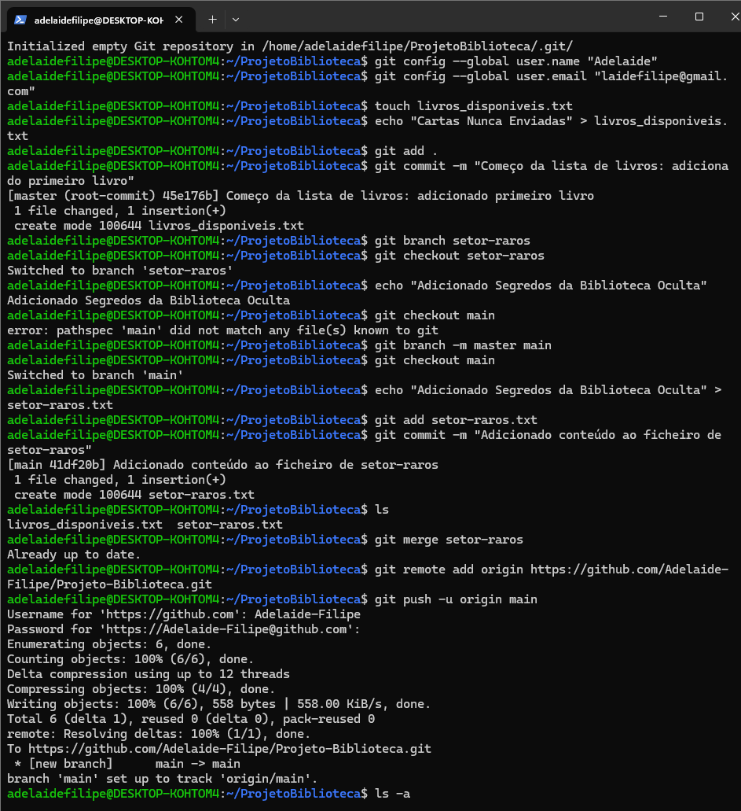

Projeto de gestão de biblioteca 

Comecei por configurar o meu ambiente de trabalho no Linux através do WSL, onde criei a pasta ProjetoBiblioteca e a transformei num repositório Git com o comando init. Depois de configurar o meu nome e e-mail globalmente no terminal, criei o meu primeiro ficheiro de catálogo chamado livros_disponiveis.txt e fiz o meu commit inicial no branch master. Para organizar melhor os livros, decidi criar um ramo separado chamado setor-raros, onde adicionei conteúdos específicos sobre obras ocultas antes de renomear o meu ramo principal de master para main e voltar para ele para consolidar o trabalho. Durante o processo, criei novos ficheiros como o setor-raros.txt e o REGRAS_BIBLIOTECA.txt, garantindo que cada passo era registado localmente com mensagens de commit claras. Quando chegou o momento de enviar tudo para o GitHub, conectei o meu repositório local ao remoto e deparei-me com a necessidade de usar uma autenticação segura. Como o terminal Linux não faz o login automático como no Windows, tive de ir às configurações de programador do GitHub para gerar um Personal Access Token com as permissões de repositório necessárias. Por fim, usei esse token como a minha senha no terminal para realizar o push com sucesso, verificando ainda as entranhas do projeto ao explorar a pasta oculta .git e o seu ficheiro de configuração para entender como o Git rastreia o meu trabalho na nuvem. 
Depois de ter tudo a funcionar no terminal, decidi criar um pequeno resumo do processo e incluir capturas de ecrã para ilustrar cada etapa. Inicialmente fiz isso no Word, mas depois pensei: por que não colocar diretamente no meu projeto?

Transferi uma imagem do Windows para o Linux e incorporei-a neste resumo.

Ao adicionar a captura de ecrã do terminal diretamente no repositório, consegui não apenas documentar os comandos utilizados, mas também tornar o processo mais visual. Ver o meu terminal no GitHub foi o passo final para transformar este exercício numa verdadeira demonstração do meu esforço e dedicação à aprendizagem.

